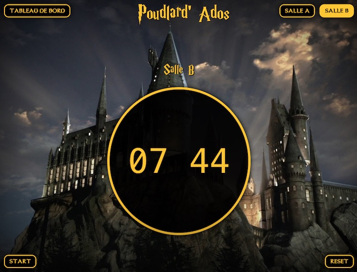

# Sablier des sorciers

Compteurs multi salles pour un escape game autour du thème de Harry Potter



L'interface possède 3 écrans :

- le tableau de bord affiche les chrono de l'ensemble des salles
- salle A n'affiche le chrono que de cette salle + le contrôle start/pause/reset
- salle B n'affiche le chrono que de cette salle + le contrôle start/pause/reset

Il y a à la fois une horloge locale sur chaque client, et une horloge centrale côté serveur, ce qui permet de faire des refresh côté client sans perdre d'info. Pas de persistence des données côté serveur, juste en mémoire.

## Démo

Une instance publique de test est disponible à l'url suivante :
http://sablier-des-sorciers.aerogus.net
attention c'est open bar, pas d'authentification

## Prérequis

* node.js stable (actuellement v14)
* npm
* git

Une ou plusieurs machines/écran reliées au même réseau local (via wifi ou ethernet). Pas besoin de la connectivité internet, tout peut tourner localement.

## Installation

Récupération des sources

```
git clone https://github.com/aerogus/sablier-des-sorciers.git
cd sablier-des-sorciers
```

Copiez le fichier `conf/settings.json.dist` vers `conf/settings.json` et adaptez le pour saisir l'ip ou le host de la machine serveur et le nombre de rooms à créer...

Si Docker est installé, vous pouvez utiliser la commande suivante :

```
docker run -p 80:80 .
```

sinon

```
npm install
npm start
```

Devrait afficher

```
> sablier-des-sorciers@1.0.0 start /Users/gus/workspace/sablier-des-sorciers
> ./app/server.js

[2021-07-13 11:35:29] '127.0.0.1 server starting...'
[2021-07-13 11:35:29] 'listening to port 80'
```

Allez maintenant avec votre navigateur à l'url `http://127.0.0.1`

## Lancement au démarrage

Pour lancer le serveur au démarrage de la machine, sous Debian avec `systemd`, en root (ou préfixé par sudo) :

Adaptez le fichier `./services/sablier-des-sorciers.service` (chemin de l'app)

```
cp ./services/sablier-des-sorciers.service /etc/systemd/system
systemctl daemon-reload
systemctl enable sablier-des-sorciers
systemctl start sablier-des-sorciers
```

## Raccourcis clavier

| Touche | Description |
|--------|-------------|
| F | passage en **F**ull screen
| S | **S**tart du compteur pour la salle courante
| P | **P**ause du compteur pour la salle courante
| R | **R**eset du compteur pour la salle courante
| T | aller au **T**ableau de bord
| A | aller à la salle **A**
| B | aller à la salle **B**

## Installation avec un certificat TLS pour le https

Utiliser le client certbot

Lancer le mini serveur web `./certbot/server.js` qui tourne sur le port 80, il doit être accessible de l'extérieur pour le acme challenge

Voir la doc de `certbot` pour la génération du certificat.

https://certbot.eff.org/lets-encrypt/debianbuster-other

## Ressources

* exemple de décompte, vidéo YouTube: https://www.youtube.com/watch?v=UeQAarcw000
* Utilisation du logiciel Max: https://www.youtube.com/watch?v=xA_VLpMBRZE
* Une app node.js de gestion multi horloge multi clients : https://github.com/josephdadams/TimeKeeper
